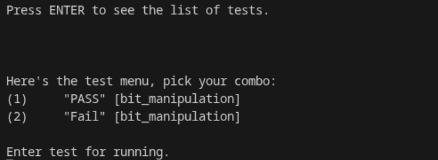
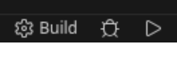
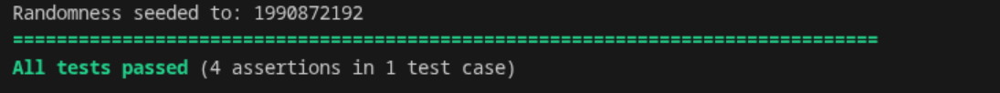
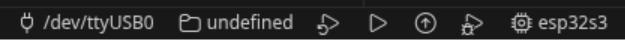

# Exercise 3 - ESP32 Dut Unit and Host unit

This markdown is intended to be used as a guide on how to run this exercise. The goal of this exercise is getting this to run on your esp32s3 display devkit with the proper menu and getting host-based unit-tests on your pc:



## Part 1: Host-based unit-tests

Host-based unit-tests run on your pc instead of the target and mostly done on generic function which do not need hardware. For example: Math functions, Business Logic, Data structures, e.g. Host-based unit-tests are cheap, as they run fast locally on your pc and do not require to flash any mcu.

Sidenote: tests on hardware-functionality is possible, but requires you to create mocks/test harnass. See for example: https://github.com/RobotPatient/Manikin_Software_Libraries_V3/blob/main/tests/ads7138/test_ads7138.cpp 

Where the underlying I2C bus is simulated using a dummy read and write function, which allows the full driver to be tested.

### How to build
Prerequisities: To build the host-based unit-tests make sure you got a working GCC compiler installed on your machine and the cmake tools vscode extension installed. 

Running Windows? Make sure you've got [VS-buildtools2019](https://aka.ms/vs/16/release/vs_buildtools.exe) or visual studio installed with the `Desktop development with C/C++ pack installed`

Now try in vscode: 
1. CTRL+SHIFT+P -> CMake: Select a kit
2. [SCAN FOR KITS]
3. Select `Visual Studio Build Tools 2019 Release - x86_amd64`
4. It should be configured by now

Running Ubuntu/Redhat/Arch? Install the `build-essentials ninja-build` package using apt on ubuntu, `cmake ninja gcc` on arch and redhat-based distro's. After which you can open this folder using vscode.

### How to run
Now using the play button in the bottom bar, build and run the host-based unit-tests


After which you should get:


## Part 2: DUT based unit-tests

DUT based unit-tests run on the ESP32-S3 target and can utilize the build-in hardware. Providing you the possibility to build scenario-based tests. Which is the way you will prove your software at the end of this course.

### How to build
Prerequisities: To build these tests you will need esp-idf to be fully configured.

1. Open the unity-app subfolder in vscode:

```bash
code unity-app
```
2. Set the target to esp32s3 in vscode toolbar and the port to the right com port.


3. Now use the wrench tool icon in vscode toolbar to build the dut-test.


### How to run
Now within vscode click on the fire icon in the vscode toolbar to build, flash & monitor the DUT test.

After which you should be greeted by the dut menu. If you see the two basic tests present. You succeeded in running the example, congratulations!

If not, check the CMakeLists.txt in the unity-app folder. Add these if they are missing:

```cmake
# Add newly added components to one of these lines:
# 1. Add here if the component is compatible with IDF >= v4.3
set(EXTRA_COMPONENT_DIRS "../components")

set(TEST_COMPONENTS bit_operation)

```

Still not working? Check the port and esp32 target if they are correctly set to your com port and the esp32s3 target.
